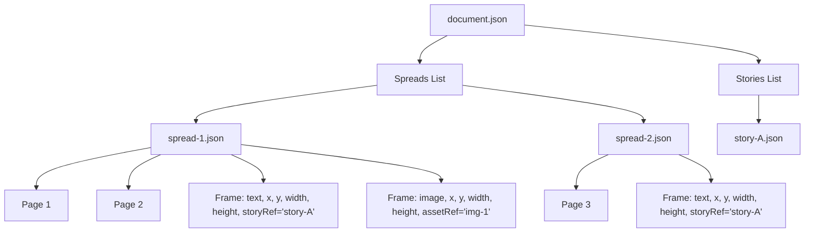
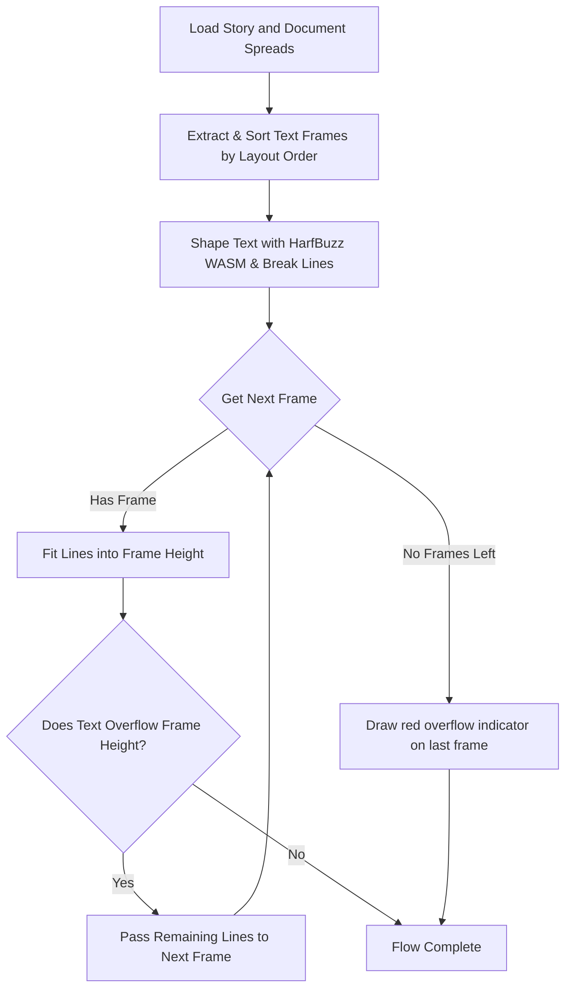

# Multispread Documents & Text Flow Design

This document details the architecture, coordinate system mapping, and text-flow algorithms for handling multi-page spreads and chained text frame rendering within the `open-layout` workspace.

---

## 1. Overview & Data Model

The document model is structured hierarchically to isolate semantic content (stories and assets) from visual layout containers (spreads and pages).



### Document (`document.json`)
Specifies the global document properties (default units, target page size, grid margins) and references the ordered collection of spreads:
```json
{
  "format": "open-layout/v1",
  "title": "Q2 Product Brochure",
  "pageSize": { "width": 210, "height": 297 },
  "spreads": [
    { "id": "spread-1", "file": "spreads/spread-1.json" },
    { "id": "spread-2", "file": "spreads/spread-2.json" }
  ]
}
```

### Spread (`spread-X.json`)
Defines the coordinate layout container. A spread contains one or more pages arranged horizontally (e.g., a left-hand/right-hand page spread) and a collection of layout `frames`:
- **Pages**: Define the physical page layout within the spread (indices and human-readable page labels).
- **Frames**: Visual containers for text or images. Text frames declare a `storyRef` to bind to a story stream.
```json
{
  "id": "spread-1",
  "pages": [
    { "index": 0, "label": "1" },
    { "index": 1, "label": "2" }
  ],
  "frames": [
    {
      "id": "frame-title",
      "type": "text",
      "x": 56.78,
      "y": 53.39,
      "width": 486,
      "height": 60,
      "storyRef": "story-title"
    }
  ]
}
```

### Story (`story-Y.json`)
Houses the rich text and styles. A story has no inherent layout bounds or page coordinates; it is a sequential flow of paragraph blocks styled individually.

---

## 2. Coordinate Spaces

A key challenge is translating coordinates between **Page-relative Space**, **Spread Space**, and **PDF Exporter Space**.

### A. Page Space
Coordinates relative to a single page's top-left corner `(0, 0)`.
- Page Width: `pageWidth`
- Page Height: `pageHeight`

### B. Spread Space
A unified horizontal coordinate space containing all pages in the spread. 
The offset for a page `i` is determined by its page index. For a page at index `i` (0-indexed horizontally):

$$\text{pageX} = (\text{page.index} \parallel i) \times \text{pageWidth}$$

For example, on a 2-page spread where each page is 595.28 points wide:
- **Page 1 (Index 0)**: bounds are $x \in [0, 595.28]$
- **Page 2 (Index 1)**: bounds are $x \in [595.28, 1190.56]$

Frames placed on Page 2 are stored in `spread.json` using absolute spread-relative coordinates (e.g., $x \ge 595.28$).

### C. PDF Exporter Space (Points)
PDF documents are represented as a sequence of independent pages. The PDF coordinate system starts at the bottom-left corner of each page, and points are defined in PostScript points ($1\text{ in} = 72\text{ pt}$).

To map a frame from **Spread Space** to a target **PDF Page**:
1. Identify which page boundary the frame overlaps on the spread.
2. Subtract the page's horizontal offset from the frame's `x` coordinate:
   $$x_{\text{page}} = x_{\text{spread}} - \text{pageX}$$
3. Flip the vertical axis to match the PDF coordinate system:
   $$y_{\text{pdf}} = \text{pageHeight} - (y_{\text{spread}} + \text{height})$$

---

## 3. Text Flow Algorithm

Text flow distributes a single semantic story across one or more chained text frames. The pipeline executes the following steps:



### 1. Frame Chain Discovery and Sorting
To flow text across pages and spreads, the engine first discovers all text frames that bind to the same `storyRef` (e.g. `story-title` or `story-body`).
- Frames are aggregated across all spreads in order.
- Within a single spread, frames are sorted by their horizontal and vertical positions (`x` coordinate first, then `y` coordinate) to ensure natural page-reading flow.

### 2. Multi-Page Layout Flow
The line-breaker flows text sequentially. For each frame in the sorted chain:
1. It calculates the maximum number of lines the frame can hold based on the frame height and line heights.
2. It shapes paragraphs line-by-line using the active fonts.
3. Lines are fitted into the frame. Once the vertical boundary is reached, any remaining unrendered lines are passed to the next frame in the chain.
4. If no more frames are left and text remains, the last frame enters the *overflow* state (drawing a red overflow indicator in the editor).

---

## 4. Verification & Testing Conventions

Any modifications to the multi-page structure or text flow engine must be validated using Playwright E2E browser tests:

- **Cross-Spread Navigation**: Tests must verify that switching active spreads in the editor panel (e.g. `pages-panel.spec.js`) successfully auto-saves outstanding modifications and keeps new text boxes isolated to the spread they were created on.
- **PDF Content Verification**:
  Because the PDF generator renders characters individually using precise position shifts (e.g., `(c) Tj`), E2E assertions (e.g. `pdf-exporter.spec.js`) should:
  1. Extract all text chunks matching the pattern `\(([^)]*)\)\s*Tj`.
  2. Strip whitespace and line-breaking hyphens: `.replace(/\s+/g, '').replace(/-/g, '')`.
  3. Assert that the semantic text sequence is present in the reconstructed stream.
