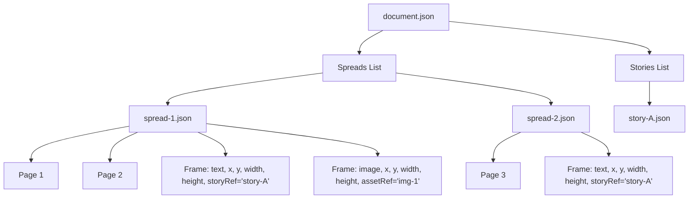
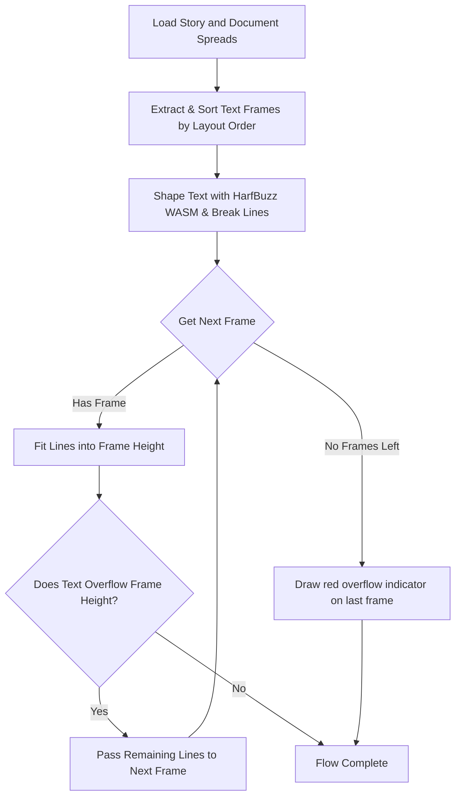

# Multispread Documents & Text Flow Design

This document details the architecture, coordinate system mapping, and text-flow algorithms for handling multi-page spreads and chained text frame rendering within the `open-layout` workspace.

---

## 1. Overview & Data Model

The document model is structured hierarchically to isolate semantic content (stories and assets) from visual layout containers (spreads and pages).



### Document (`document.json`)

Specifies the global document properties (default units, target page size, grid margins) and references the ordered collection of spreads:

```json
{
  "format": "open-layout/v1",
  "title": "Q2 Product Brochure",
  "pageSize": { "width": 210, "height": 297 },
  "spreads": [
    { "id": "spread-1", "file": "spreads/spread-1.json" },
    { "id": "spread-2", "file": "spreads/spread-2.json" }
  ]
}
```

### Spread (`spread-X.json`)

Defines the coordinate layout container. A spread contains one or more pages arranged horizontally (e.g., a left-hand/right-hand page spread) and a collection of layout `frames`:

- **Pages**: Define the physical page layout within the spread (indices and human-readable page labels).
- **Frames**: Visual containers for text or images. Text frames declare a `storyRef` to bind to a story stream.
  
  ```json
  {
  "id": "spread-1",
  "pages": [
    { "index": 0, "label": "1" },
    { "index": 1, "label": "2" }
  ],
  "frames": [
    {
      "id": "frame-title",
      "type": "text",
      "x": 56.78,
      "y": 53.39,
      "width": 486,
      "height": 60,
      "storyRef": "story-title"
    }
  ]
  }
  ```

### Story (`story-Y.json`)

Houses the rich text and styles. A story has no inherent layout bounds or page coordinates; it is a sequential flow of paragraph blocks styled individually.

---

## 2. Coordinate Spaces

A key challenge is translating coordinates between **Page-relative Space**, **Spread Space**, and **PDF Exporter Space**.

### A. Page Space

Coordinates relative to a single page's top-left corner `(0, 0)`.

- Page Width: `pageWidth`
- Page Height: `pageHeight`

### B. Spread Space

A unified horizontal coordinate space containing all pages in the spread. 
The offset for a page `i` is determined by its page index. For a page at index `i` (0-indexed horizontally):

$$\text{pageX} = (\text{page.index} \parallel i) \times \text{pageWidth}$$

For example, on a 2-page spread where each page is 595.28 points wide:

- **Page 1 (Index 0)**: bounds are $x \in [0, 595.28]$
- **Page 2 (Index 1)**: bounds are $x \in [595.28, 1190.56]$

Frames placed on Page 2 are stored in `spread.json` using absolute spread-relative coordinates (e.g., $x \ge 595.28$).

### C. PDF Exporter Space (Points)

PDF documents are represented as a sequence of independent pages. The PDF coordinate system starts at the bottom-left corner of each page, and points are defined in PostScript points ($1\text{ in} = 72\text{ pt}$).

To map a frame from **Spread Space** to a target **PDF Page**:

1. Identify which page boundary the frame overlaps on the spread.
2. Subtract the page's horizontal offset from the frame's `x` coordinate:
   $$x_{\text{page}} = x_{\text{spread}} - \text{pageX}$$
3. Flip the vertical axis to match the PDF coordinate system:
   $$y_{\text{pdf}} = \text{pageHeight} - (y_{\text{spread}} + \text{height})$$

---

## 3. Text Flow Algorithm

Text flow distributes a single semantic story across one or more chained text frames. The pipeline executes the following steps:



### 1. Frame Chain Discovery and Sorting

To flow text across pages and spreads, the engine first discovers all text frames that bind to the same `storyRef` (e.g. `story-title` or `story-body`).

- Frames are aggregated across all spreads in order.
- Within a single spread, frames are sorted by their horizontal and vertical positions (`x` coordinate first, then `y` coordinate) to ensure natural page-reading flow.

### 2. Multi-Page Layout Flow

The line-breaker flows text sequentially. For each frame in the sorted chain:

1. It calculates the maximum number of lines the frame can hold based on the frame height and line heights.
2. It shapes paragraphs line-by-line using the active fonts.
3. Lines are fitted into the frame. Once the vertical boundary is reached, any remaining unrendered lines are passed to the next frame in the chain.
4. If no more frames are left and text remains, the last frame enters the *overflow* state (drawing a red overflow indicator in the editor).

---

## 4. Verification & Testing Conventions

Any modifications to the multi-page structure or text flow engine must be validated using Playwright E2E browser tests:

- **Cross-Spread Navigation**: Tests must verify that switching active spreads in the editor panel (e.g. `pages-panel.spec.js`) successfully auto-saves outstanding modifications and keeps new text boxes isolated to the spread they were created on.
- **PDF Content Verification**:
  Because the PDF generator renders characters individually using precise position shifts (e.g., `(c) Tj`), E2E assertions (e.g. `pdf-exporter.spec.js`) should:
  
  1. Extract all text chunks matching the pattern `\(([^)]*)\)\s*Tj`.
  
  2. Strip whitespace and line-breaking hyphens: `.replace(/\s+/g, '').replace(/-/g, '')`.
  
  3. Assert that the semantic text sequence is present in the reconstructed stream.

---

## 5. Critical Analysis & Performance Suggestions for Large Documents (e.g., 150 Spreads / 300 Pages)

When scaling the document model to a full-length book (e.g., 150 spreads/300 pages), the current multi-spread and text-flow design faces significant bottlenecks in I/O, memory usage, CPU load, and flow correctness.

### A. Core Bottlenecks in the Current Design

1. **Independent/Isolated Spread Layout (Correctness Bug)**:
   - Currently, the engine performs layout by iterating through spreads and executing `_layoutSpread` for each spread in isolation.
   - If a single `storyRef` (e.g., `story-body`) spans across multiple spreads, there is no global flow state propagation. Each spread loads the story from the beginning, meaning a chained story restarts from paragraph 1 on every spread instead of continuing where the previous spread left off.
   
2. **I/O Fetch Storm ($O(N)$ HTTP Requests)**:
   - For 150 spreads, the client/renderer makes individual fetch requests for each `spread-X.json`.
   - Furthermore, `_layoutSpread` makes duplicate fetches per-spread for `assets.aggregate.json` and the style/story files. If a main story is referenced across all 150 spreads, it will be fetched and parsed 150 times.
   - This can trigger 500+ HTTP requests, leading to severe head-of-line blocking under browser parallel request limits.

3. **Redundant CPU Shaping and Parsing**:
   - Shaping paragraphs with HarfBuzz WASM (`hb.wasm`) is CPU-intensive.
   - Currently, the entire story is shaped repeatedly on *every spread* where it is referenced. For a 300-page book, shaping the entire manuscript 150 times will lock the browser UI and exhaust heap memory.

4. **Lack of Virtualization and Partial Re-Layouts**:
   - Changes to text flow in an early spread (e.g., spread 2) force a full re-layout of all subsequent spreads. Without virtualization, rendering 150 spreads in the DOM concurrently degrades interactive performance.

---

### B. Recommendations for Efficient Book-Scale Layout

To support 150+ spreads efficiently, the layout architecture should be updated as follows:

#### 1. Implement a Unified/Global Document Layout Pipeline
- **Global Box Chain**: Load all spreads, aggregate all text frames, and sort them globally across the entire document.
- **Single-Pass Flow**: Shape the story text once and flow it sequentially through the global sorted box list. Track and pass the character/line offset from the end of one spread directly to the start of the next spread.

#### 2. Introduce Document Bundling / Batch Loading APIs
- **Bulk Metadata Endpoint**: Implement a server-side endpoint `/store/${docPath}/bundle` that returns `document.json`, all spread definitions, asset metadata, and styles in a single JSON payload. This reduces connection overhead from $O(N)$ HTTP requests to $O(1)$.
- **Lazy Story Loading**: Only load and shape story segments/chapters that are currently within or near the viewport.

#### 3. Limit Flow Propagation via Chapter/Section Breaks
- **Story Segmentation**: Encourage or enforce dividing large books into separate story files (e.g., `story-chapter-1.json`, `story-chapter-2.json`).
- **Flow Breakpoints**: When text is edited, only propagate layout updates to subsequent frames. Halt propagation as soon as a text flow change does not push lines past the boundaries of the current spread (i.e., the layout converges).

#### 4. Layout Caching, Invalidation, & On-Demand Pagination
To achieve $O(1)$ rendering for any arbitrary spread, implement an **array-based Flow Anchor Cache**:

* **State Representation**: Maintain a single document-wide array `layoutCache` where the index corresponds to the spread index:
  ```javascript
  // layoutCache[spreadIndex] -> Map of storyRef -> Flow offset object
  const layoutCache = [
    { "story-main": { paragraphIndex: 0, runIndex: 0, charOffset: 0 } },  // Spread 0
    { "story-main": { paragraphIndex: 4, runIndex: 1, charOffset: 12 } }, // Spread 1
    null,                                                                 // Spread 2 (invalidated)
    null                                                                  // Spread 3 (invalidated)
  ];
  ```
* **$O(1)$ Cache Invalidation**: When any modification (editing text, moving/resizing frames) occurs on Spread $K$, instantly invalidate downstream cache entries:
  ```javascript
  // Discard all downstream anchors
  layoutCache.fill(null, K + 1);
  ```
* **On-Demand (Lazy) Pagination**: When the editor needs to render Spread $M$:
  1. **Cache Hit**: If `layoutCache[M]` is non-null, immediately render the spread using these story starting points.
  2. **Cache Miss**: If `layoutCache[M]` is null, walk backward to find the nearest valid spread index $J < M$ (index `0` is always valid). Flow the text sequentially from $J$ to $M$, caching the calculated start offsets for all intermediate spreads ($J+1 \dots M$) along the way.
* **Early-Exit (Convergence)**: When lazy-resolving a cache miss or propagating updates downstream, if the calculated start offset for Spread $P$ matches its existing cached offset (`newOffset === layoutCache[P]`), propagation can safely halt immediately without re-rendering spreads $P+1$ to $N$.
* **Shaping Cache**: Cache shaped paragraphs (glyph indices and widths) in a map keyed by paragraph contents and style definitions to avoid redundant HarfBuzz WASM invocations.

#### 5. Viewport Virtualization
- **Lazy DOM Rendering**: In the spread-editor, only render the DOM/SVG nodes for the active spread and its immediate neighbors (e.g., $N-1, N, N+1$). Represent other spreads with lightweight placeholder elements matching their physical dimensions to keep the DOM tree small and responsive.
