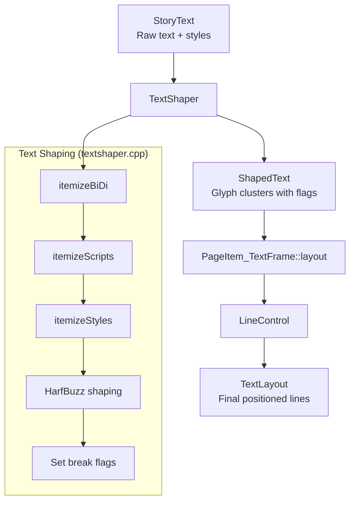

# Scribus Line Breaking Algorithm for Text Frames

This document describes the line breaking algorithm used in Scribus text frames, which handles the complex task of flowing text within rectangular or shaped regions.

## Overview

The line breaking algorithm in Scribus is a **greedy, first-fit algorithm** that processes text character-by-character (or glyph-cluster-by-cluster) and determines optimal break points based on:

1. Available line width (considering text-flow regions and margins)
2. Unicode line-breaking rules (via ICU's BreakIterator)
3. Hyphenation opportunities
4. CJK-specific breaking rules
5. Justification constraints

## Architecture



## Phase 1: Text Shaping and Break Detection

### File: [textshaper.cpp](file:///home/martino/git/scribus/scribus/text/textshaper.cpp)

Before layout begins, text is shaped using HarfBuzz with break points marked:

### 1.1 BiDi Itemization
```cpp
// Uses ICU's UBiDi to split text into runs with consistent direction
QList<TextRun> bidiRuns = itemizeBiDi(fromPos);
```

### 1.2 Script Itemization
```cpp
// Further splits runs by Unicode script (Latin, Arabic, CJK, etc.)
QList<TextRun> scriptRuns = itemizeScripts(bidiRuns);
```

### 1.3 Line Break Detection (ICU BreakIterator)
```cpp
BreakIterator* lineIt = StoryText::getLineIterator();
icu::UnicodeString unicodeStr(true, (const UChar*) m_text.utf16(), m_text.length());
lineIt->setText(unicodeStr);
for (int32_t pos = lineIt->first(); pos != BreakIterator::DONE; pos = lineIt->next())
    lineBreaks.append(pos);
```

This uses **ICU's line break detection** following Unicode Standard Annex #14 (Line Breaking Properties).

### 1.4 Setting Break Flags on Glyph Clusters

Each `GlyphCluster` receives flags indicating break opportunities:

| Flag | Description |
|------|-------------|
| `ScLayout_LineBoundary` | Marks a valid line break opportunity (from ICU or CJK rules) |
| `ScLayout_NoBreakBefore` | CJK character that cannot start a line (e.g., closing punctuation) |
| `ScLayout_NoBreakAfter` | CJK character that cannot end a line (e.g., opening punctuation) |
| `ScLayout_HyphenationPossible` | Hyphenation point inserted by the hyphenator |

**CJK-specific logic:**
```cpp
// CJK characters can break between any two characters unless marked otherwise
if ((firstChar > 0) && (firstStat != 0) && ((firstStat & SpecialChars::CJK_NOBREAK_BEFORE) == 0))
{
    if (prevStat != 0 && ((prevStat & SpecialChars::CJK_NOBREAK_AFTER) == 0))
        run.setFlag(ScLayout_LineBoundary);
}
```

---

## Phase 2: Line Layout Algorithm

### File: [pageitem_textframe.cpp](file:///home/martino/git/scribus/scribus/pageitem_textframe.cpp)

The main layout loop in `PageItem_TextFrame::layout()` processes each glyph cluster and manages line state through the `LineControl` structure.

### 2.1 LineControl Structure

```cpp
struct LineControl {
    LineSpec lineData;           // Current line metrics (x, y, width, height, ascent, descent)
    QList<GlyphCluster> glyphs;  // Glyphs in current line
    bool isEmpty;                // True if no glyphs placed yet
    int hyphenCount;             // Consecutive hyphenated lines
    double colWidth, colLeft, colRight;  // Column boundaries
    int breakIndex;              // Index of last break opportunity
    double breakXPos;            // X position at break point
    double maxShrink, maxStretch; // Justification limits
    // ...
};
```

### 2.2 Main Loop Pseudocode

```
FOR each glyph cluster (i):
    1. Handle paragraph/drop-cap/bullet starts
    2. Calculate glyph position considering tabs
    3. Update xPos with glyph width
    
    4. Check if end-of-line reached:
       IF xPos > colRight OR is_break_char(current):
           IF breakIndex < 0:
               // Force break at current/previous position
               breakLine(i)
           ELSE:
               // Use remembered break point
               revert to breakIndex
               IF hyphenation point:
                   insert hyphen glyph
               finishLine()
               justifyLine() OR indentLine()
               add line to TextLayout
               startLine(breakIndex + 1)
       ELSE:
           // Within line, check for break opportunities
           IF next cluster has LineBoundary flag:
               rememberBreak(i, xPos)
    
    5. Handle column/frame overflow
    6. Handle special chars (COLBREAK, FRAMEBREAK, LINEBREAK)
```

### 2.3 Key Methods

#### rememberBreak()
Records a potential break point. The algorithm prefers breaks closer to the right margin:

```cpp
void rememberBreak(int index, double pos, double morespace = 0)
{
    if (pos > colRight - morespace)
    {
        // Already past edge - compare with existing break
        if (breakIndex >= 0)
        {
            double oldLooseness = qAbs(colRight - breakXPos);
            double newLooseness = pos - colRight;
            if (newLooseness >= oldLooseness)
                return;  // Keep old break
        }
    }
    breakXPos = pos;
    breakIndex = index;
}
```

#### breakLine()
Commits a line break at a mandatory break point:

```cpp
void breakLine(int last)
{
    breakIndex = last;
    breakXPos = lineData.x;
    
    for (int i = 0; i <= breakIndex - lineData.firstCluster; i++)
        breakXPos += glyphs.at(i).width();
    
    updateHeightMetrics();
}
```

#### finishLine()
Finalizes line metrics:

```cpp
void finishLine(double endX)
{
    lineData.lastCluster = breakIndex;
    lineData.naturalWidth = breakXPos - lineData.x;
    lineData.width = endX - lineData.x;
    maxShrink = maxStretch = 0;
}
```

---

## Phase 3: Justification

When text is justified, the algorithm distributes extra space using a priority system:

### Justification Priority

1. **Glyph extension** (stretch/shrink glyphs within `minGlyphExtension` / `maxGlyphExtension` limits)
2. **Space insertion** (for scripts without word spaces like Thai)
3. **Space extension** (expand/compress word spaces)
4. **Tracking insertion** (add letter-spacing for scripts like Thai)

### justifyLine() Algorithm

```cpp
void justifyLine(const ParagraphStyle& style)
{
    1. Measure natural width of glyphs and spaces
    
    2. Calculate extensions:
       IF line can fit with glyph shrinking:
           glyphExtension = minGlyphExtension - 1
           spaceExtension = (lineWidth - glyphWidth*(1+ext)) / spaceWidth - 1
       ELSE IF line can fit with glyph stretching:  
           spaceExtension = 0
           glyphExtension = (lineWidth - spaceWidth) / glyphWidth - 1
       ELSE:
           // Use maximum glyph extension + space insertion
           
    3. Apply scaling to each glyph cluster:
       FOR each cluster:
           IF not expanding space:
               cluster.scaleH *= glyphScale
           ELSE IF not suppressed:
               cluster.extraWidth += width * spaceExtension
           IF implicit space location:
               previousCluster.extraWidth += imSpace
}
```

---

## Phase 4: Special Cases

### Hyphenation

When a hyphenation point is used:
```cpp
if (current.glyphs[currentIndex].hasFlag(ScLayout_HyphenationPossible))
{
    current.hyphenCount++;
    GlyphLayout hyphen;
    hyphen.glyph = font.hyphenGlyph(charStyle);
    hyphen.xadvance = font.hyphenWidth(charStyle, fontSize);
    current.glyphs[currentIndex].append(hyphen);
    current.breakXPos += hyphWidth;
}
```

Hyphenation is limited by `style.hyphenConsecutiveLines()`.

### Optical Margins

Punctuation can "hang" outside the text margin:
```cpp
if (opticalMargins & ParagraphStyle::OM_RightHangingPunct)
    current.lineData.width += current.opticalRightMargin(itemText);
if (opticalMargins & ParagraphStyle::OM_LeftHangingPunct)
{
    current.lineData.width += current.opticalLeftMargin(itemText);
    current.lineData.x -= current.opticalLeftMargin(itemText);
}
```

### Drop Caps

Drop caps span multiple lines and affect the left margin:
```cpp
if (DropCmode)
{
    // Adjust glyph size and position
    current.yPos = maxDY;  // Hold Y position across drop cap lines
    maxDX = dropCapBox.width();  // Indent subsequent lines
}
```

---

## Flow Around Objects

The algorithm respects text-wrap regions using `QRegion`:

```cpp
double endOfLine(const QRegion& shape, double morespace, int yAsc, int yDesc)
{
    double maxX = colRight - morespace;
    
    // Check if shape intersects line area
    QPolygon p;
    p.append(QPoint(startX, yAsc));
    p.append(QPoint(startX, yDesc));
    p.append(QPoint(maxX, yAsc));
    p.append(QPoint(maxX, yDesc));
    
    QRegion lineI = shape.intersected(p.boundingRect());
    
    // Find rightmost valid X by stepping in 0.25pt increments
    double endX2 = startX;
    while (endX2 < maxX && regionContainsRect(shape, pt))
    {
        pt.moveTopLeft(QPoint(endX2 + morespace, yAsc));
        endX2 += 0.25;
    }
    
    return qMin(endX2, maxX);
}
```

---

## Summary

The Scribus line breaking algorithm combines:

- **ICU BreakIterator** for Unicode-compliant line break detection
- **HarfBuzz** for proper text shaping with script-aware itemization
- **Greedy first-fit** line filling with break point memory
- **Multi-priority justification** respecting typographic constraints
- **Region-based text flow** for complex frame shapes

This produces professional-quality text layout suitable for publishing applications.
